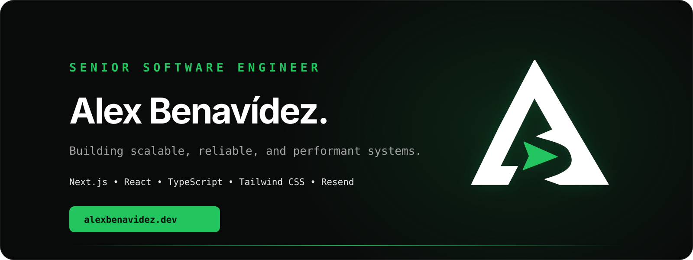
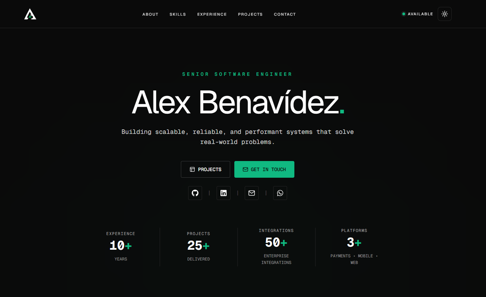
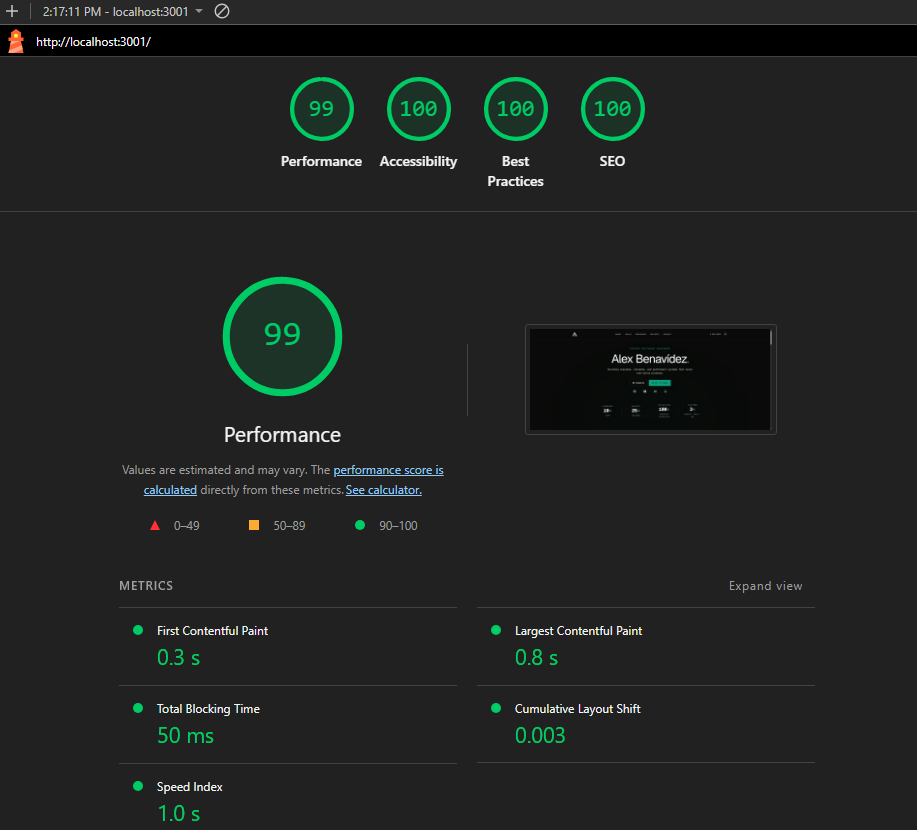

<p align="center">
  
</p>

<p align="center">
  <a href="https://alexbenavidez.dev"><strong>Live Website</strong></a>
</p>

<p align="center">
  
  
  
  
  
  
</p>

---

## Overview

This repository contains the source code for my personal engineering portfolio.

The portfolio presents my experience as a Senior Software Engineer working across enterprise systems, full-stack development, system integrations, Android applications, financial platforms, and practical AI-enabled products.

The project was built with a strong focus on performance, accessibility, responsive design, maintainability, and production-ready engineering practices.

Release 2 expands the portfolio with detailed technical case studies designed to explain not only what I built, but also the architecture, engineering decisions, challenges, security considerations, and outcomes behind each project.

## Preview

<p align="center">
  
</p>

---

## Features

- Responsive design across desktop, tablet, and mobile
- Dark and light themes
- Dynamic technical project case studies
- Static generation for project detail pages
- Per-project SEO metadata
- Architecture and workflow diagrams
- Responsive and theme-aware technical media
- Recruiter-friendly engineering documentation
- Contact form with server-side validation
- Email delivery through Resend
- Honeypot and request throttling for spam protection
- Custom domain with Cloudflare DNS
- SEO metadata, Open Graph, Twitter cards, sitemap, and robots directives
- Custom loading, error, and not-found pages
- Vercel Analytics and Speed Insights
- Accessible, type-safe component architecture
- Reduced-motion accessibility support
- Optimized image loading and responsive media delivery

---

## Technical Case Studies

Release 2 introduces dedicated project pages focused on architecture, engineering decisions, security, technical challenges, and project impact.

### Developer Portfolio

Production portfolio built with Next.js, React, TypeScript, Tailwind CSS, Vercel, Cloudflare, and Resend.

Focus areas:

- Server-first architecture
- Theme architecture
- Secure contact workflow
- SEO
- Performance
- Accessibility
- Production deployment

### Payment Gateway Platform

Enterprise multi-tenant payment platform integrated with Cybersource.

Focus areas:

- Multi-tenancy
- Authentication and authorization
- Payment orchestration
- Transaction lifecycle management
- Auditability
- Operational monitoring

Private enterprise project. Architecture and flow documentation is sanitized for public presentation.

### Enterprise Integration Platform

Enterprise integration environment connecting banking systems with government institutions, financial services, remittance providers, and third-party systems.

Focus areas:

- Oracle Service Bus
- WebLogic
- SOAP / REST mediation
- XQuery transformations
- JMS asynchronous processing
- API Gateway integration
- Certificate-based integrations
- Enterprise integration standards

Private enterprise project. Public documentation intentionally excludes confidential infrastructure details.

### Agent Banking Platform

Native Android platform deployed on PAX smart POS devices for distributed banking services.

Focus areas:

- Kotlin
- Jetpack Compose
- Clean Architecture
- MVVM
- PAX hardware integration
- Secure mobile communication
- Android Keystore
- Runtime integrity controls

Private enterprise project. Architecture documentation is intentionally sanitized.

### CleanSlate AI

Public AI-assisted CSV data-quality application combining deterministic validation with semantic LLM analysis.

Focus areas:

- Deterministic + AI analysis
- OpenAI API
- GPT-5.6 Luna
- Structured AI output
- Zod validation
- Human-in-the-loop review
- Safe server-side AI integration

- Live: https://cleanslate-ai.vercel.app/
- Source: https://github.com/asamuel/cleanslate-ai

---

## Tech Stack

| Category | Technologies |
| --- | --- |
| Framework | Next.js 16 |
| UI | React 19 |
| Language | TypeScript |
| Styling | Tailwind CSS 4 |
| Components | shadcn/ui |
| Forms | React Hook Form + Zod |
| Email | Resend |
| Analytics | Vercel Analytics + Speed Insights |
| Hosting | Vercel |
| DNS | Cloudflare |

---

## Architecture

The portfolio uses the Next.js App Router with a server-first approach.

Content-heavy pages remain Server Components by default, while browser-dependent behavior is isolated behind focused Client Components.

Project content is stored as strongly typed static data and rendered through a dynamic route:

```text
/projects/[slug]
```

Project pages use:

- `generateStaticParams()` for static generation
- `generateMetadata()` for project-specific metadata
- typed project constants
- reusable case-study sections
- responsive media variants
- theme-aware architecture diagrams

Technical diagrams can provide separate assets for:

```text
Desktop Light
Desktop Dark
Mobile Light
Mobile Dark
```

Only the asset required by the current viewport and theme is rendered.

---

## Performance & Accessibility

The production project case-study page achieved:

| Metric | Score |
| --- | ---: |
| Performance | 100 |
| Accessibility | 100 |
| Best Practices | 100 |
| SEO | 100 |

Measured with Lighthouse against the production deployment.

Additional optimizations include:

- Server Components by default
- Reduced unnecessary client-side JavaScript
- Responsive image sizing
- Reserved media aspect ratios to reduce layout shifts
- Route-prefetch control where unnecessary prefetching would load unrelated bundles
- Semantic heading hierarchy
- Reduced-motion support

<p align="center">
  
</p>

---

## Project Structure

```text
src
├── app
│   ├── api
│   ├── projects
│   │   └── [slug]
│   │       ├── _components
│   │       └── page.tsx
│   ├── error.tsx
│   ├── loading.tsx
│   ├── manifest.ts
│   ├── not-found.tsx
│   ├── robots.ts
│   └── sitemap.ts
├── components
│   ├── layout
│   ├── shared
│   └── ui
├── constants
│   └── projects
├── lib
├── sections
├── services
├── types
└── validations
```

---

## Local Development

Clone the repository:

```bash
git clone https://github.com/asamuel/alex-portfolio.git
```

Install dependencies:

```bash
npm install
```

Run the development server:

```bash
npm run dev
```

Open:

```text
http://localhost:3000
```

---

## Environment Variables

Create a `.env.local` file:

```env
RESEND_API_KEY=

RESEND_FROM=

CONTACT_EMAIL=
```

Secrets are used only from server-side application boundaries.

---

## Deployment

The application is deployed with **Vercel**.

The custom domain and DNS configuration are managed through **Cloudflare**.

Transactional contact email is delivered using **Resend**.

---

## Release Roadmap

### Release 1 — Portfolio Foundation

- [x] Responsive portfolio
- [x] Dark / light theme
- [x] Professional experience and skills sections
- [x] Contact form
- [x] Email integration
- [x] SEO optimization
- [x] Custom domain
- [x] Analytics and performance monitoring
- [x] Production deployment

### Release 2 — Technical Case Studies

- [x] Dynamic project detail pages
- [x] Static project generation
- [x] Project-specific metadata
- [x] Architecture documentation
- [x] Engineering decisions
- [x] Security considerations
- [x] Challenges and impact
- [x] Responsive architecture diagrams
- [x] Theme-aware project media
- [x] Payment Gateway Platform case study
- [x] Enterprise Integration Platform case study
- [x] Agent Banking Platform case study
- [x] Developer Portfolio case study
- [x] CleanSlate AI case study
- [x] Performance and accessibility refinement

### Future

- [ ] Automated testing expansion
- [ ] Additional public technical projects
- [ ] Blog / technical writing

---

## Contact

- Website: [alexbenavidez.dev](https://alexbenavidez.dev)
- LinkedIn: [linkedin.com/in/samuelbz](https://linkedin.com/in/samuelbz)
- GitHub: [github.com/asamuel](https://github.com/asamuel)
- Email: [contact@alexbenavidez.dev](mailto:contact@alexbenavidez.dev)

---

## License

This project is available under the MIT License.
